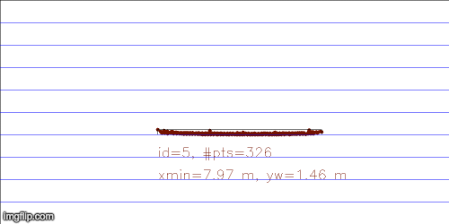
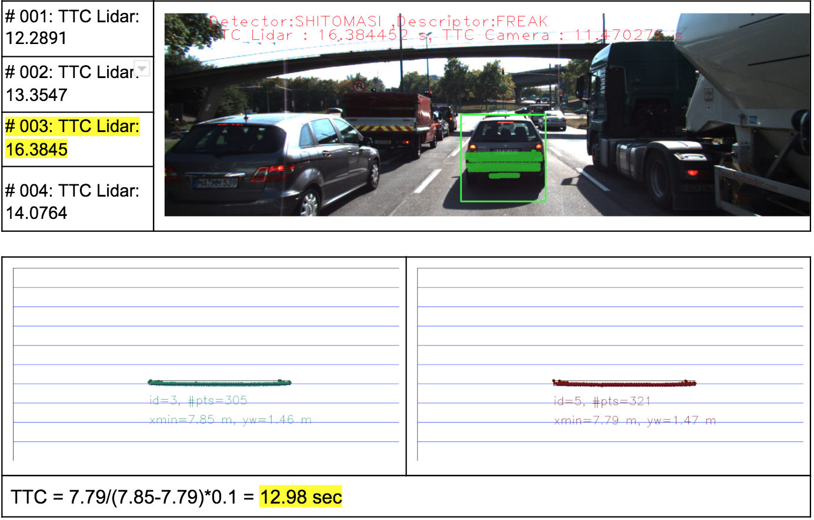
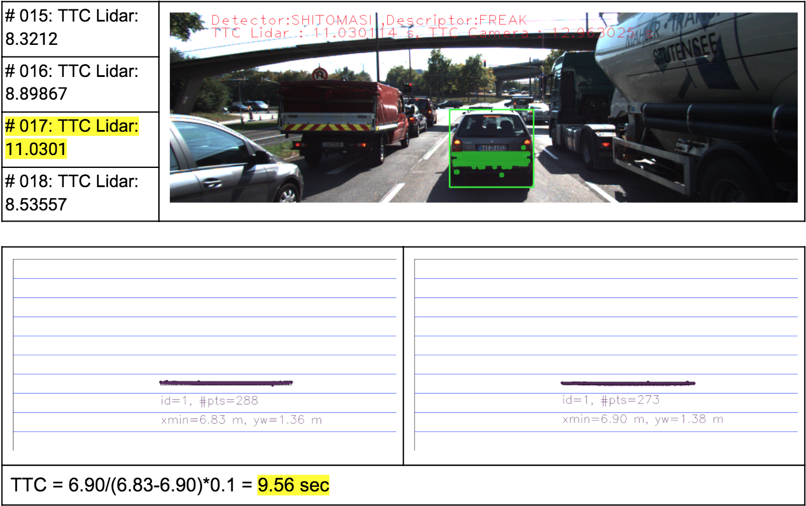
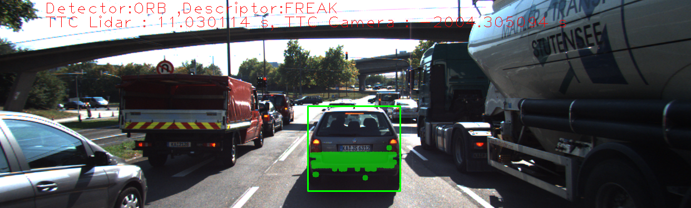
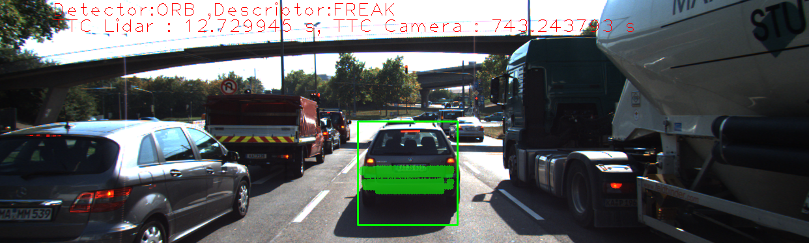
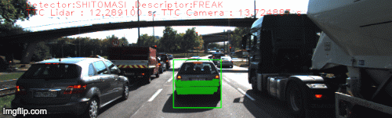

# 3D-Object-Tracking using Sensor Fusion(Camera+Lidar) 
Vehicle Tracking using YOLO v3 (image training and classification) and Lidar data

## Implementation Approach

### 1. Match 3D Object
* `matchBoundingBoxes` function 
    * takes as input both the previous and the current data frames 
    * provides as output the ids of the matched regions of interest (i.e. the boxID property). 
    * returns the specified output, where each bounding box is assigned the match candidate with the highest number of keypoint correspondences
    * after getting highest number of keypoint correspondence, these are stored in `bbBestMatched`.
    * For debug purpose, the number of bouding boxes is counted from `bbBestMatches.size()` 

### 2.Compute Lidar-based TTC
* `computeTTCLidar` function : Compute Lidar-based TTC
    * Compute the time-to-collision in second for all matched 3D objects using only Lidar measurements from the matched bounding boxes between current and previous frame 
    * from both previous and current fame, add distance to Lidar points within the ego lane (assuming lane width=4.0) 
    * outlier Lidar points are excluded which are away more than +/- lanewidth/2 (i.e. left/right lanes). 
    * Even though Lidar is a reliable sensor, erroneous measurements may still occur. When searching for the closest points, such errorneous measurements will pose a problem as the estimated distance will be too small. Thurs from previous and current Frame, `minXCurr` and `minXPrev` are calculated by taking average for both frames to cope with a certain number of outliers. Thus, the `minXCurr` and `minXPrev` are the average distances of lidar points within ego lane in the current and previous frames from preceding vehicles, respectively.
    * `TTC = minXCurr/(minXPrev-minXCurr) * 1/frameRate` from two successive frames, where frameRate is required to compute the delta time between frames and TTC will hold the result of the computation. 
    * TTC computation from the Lidar sensor is based on two noisy distance measurements whereas Radar sensor is more accurate due to direct measurement from relative velocity.
    

### 3. Associate Keypoint Correspondences with Bounding Boxes
* `clusterKptMatchesWithROI` : associate a given bounding box with the keypoints it contains 
    * Prepare the TTC computation based on camera measurements by associating keypoint correspondences to the bounding boxes which enclose them. 
    * All matches which satisfy this condition are added to a vector ; by addding the keypoint correspondences to the "kptMatches" property of the respective bounding boxes
    * outlier matches are removed based on the computation of euclidean distance between previous and current frame from matched keypoints in the bounding box. 
    * compute a robust mean of all the euclidean distances between keypoint matches and then remove those that are too far away from the mean (`threshold = mean * 1.2`)
    * for debugging purpose, displayed the number of retained matched from `kptMatches.size()`
    
    
### 4. Compute Camera-based TTC   
* `computeTTCCamera`
    * Once keypoint matches have been added to the bounding boxes, the next step is to compute the TTC estimate.
    * Stored the distance ratios(`distRatio`) for all keypoints between current and previous frame
    * Computed the time-to-collision in second for all matched 3D objects using only keypoint correspondences from the matched bounding boxes between current and previous frame.
    * Computed median distance ratio to remove outlier influence to avoid severe estimation errors.
    * kptsPrev and kptsCurr are the input keypoint sets, kptMatches are the matches between the two sets.
    * `TTC = -1 / (1 - medDistRatio) * 1/frameRate` , where frameRate is required to compute the delta time between frames and TTC will hold the result of the computation

### Lidar Top View Result 
* `show3DObjects`:
    * handle output image sizes to fit the 500x1000 size. (can be adjustable to different sizes)
    * The result is as follows  : 
    
    
### 5. Performance Evaluation 1
1. Several examples(2-3) here the TTC estimate of the Lidar sensor does not seem plausible.
* The examples where the Lidar-based TTC estimate is way off might be several points:  Since I took the statiscally robust way of calculating minimum distance from the preceding vehicles, most of TTC lidar data would be reliable, however the tendency of TTC trend is somewhat off compared to tendency of reducing TTC from the result
 
* The assertion that the TTC is off is based on manually estimating the distance to the rear of the preceding vehicle from a top view perspective of the Lidar points.

By comparing these two approaches, there are two cases that I got different TTC calculation. 
* frame #003: TTC from velodyne Lidar data is about 16 sec,whereas TTC from yolo+openCV matched lidar data is about 13 sec.   
* frame #017: TTC from velodyne Lidar data is about 11 sec,whereas TTC from yolo+openCV matched lidar data is about 9.5 sec.   
To complement these TTC differences, computing TTC from rasor sensor might be helpful since rasor sensors can detect relative velocity to compute TTC. Lidar could lead to wrong menasurement when it comes to wavy/big steering angle case, Camera could lead to worst measurement under raines, shades, lack of light. 

### 6. Performance Evaluation 1
2. All detector / descriptor combinations combinations are compared with respect to the TTC estimate on a frame-by-frame basis.
* several examples where camera-based TTC estimation is way off.
Most cases of using HARRIS detector couldnot compute TTC from camera sensors due to lack of detected keypoints from the matched bounding boxes within ego lane. Some cases, there were only two keypoints were matched between previous and current image frames. Some as ORB detecor cases as well. 

There are many cases ORB detector showed way off TTC -camera, for example 30 sec to about 2000 seconds.

* the best performing combinations 
    * **SHITOMASI detector + FREAK descriptor** >> SHITOMASI+ ORB >> SHITOMASI + BRIEF >> SHITOMASI +SIFT (SHITOMASI+BRISK is not reliable) 
    * **FAST detector + FREAK Detector** >> FAST + ORB >> FAST + BRIEF 
    * (SHITOMASI+FREAK) is slightly faster than (FAST+ FREAK) when two showed similar reliable results. So the best combination is (SHITOMASI+FREAK) combination
    
## Best Combination  

|FAST detector + FREAK Descriptor + BF_Matcher | SHITOMASI detector + FREAK Descriptor + BF_Matcher|
|---|---|
||  |

Final output vides is based on FAST Detector + FREAK Descripter matching Algorithm , and more closer the lidar cloud changes color from Green (Safe range) to Red(Collision range) gradually.   

## Runtime Environment Dependencies
* cmake >= 2.8
  * [how to install](https://cmake.org/install/)
* make >= 4.1 (Linux, Mac), 3.81 (Windows)
* OpenCV >= 4.1
  * This must be compiled from source using the `-D OPENCV_ENABLE_NONFREE=ON` cmake flag for testing the SIFT and SURF detectors.
  * [OpenCV 4.1.0 source code](https://github.com/opencv/opencv/tree/4.1.0)
* gcc/g++ >= 5.4
* yolov3.weights : Download `wget https://pjreddie.com/media/files/yolov3.weights `

### Rerefence 
* [OpenCV Feature matching: Brute Force Matcher](https://docs.opencv.org/3.4/dc/dc3/tutorial_py_matcher.html)
* [OpenCV Detector and Descriptor](https://docs.opencv.org/2.4/modules/features2d/doc/feature_detection_and_description.html)
* [Detector and matching](https://medium.com/data-breach/introduction-to-feature-detection-and-matching-65e27179885d)
* [YOLO github](https://github.com/pjreddie/darknet/wiki/YOLO:-Real-Time-Object-Detection)
* [YOLOv3: An Incremental Improvement](https://arxiv.org/abs/1804.02767)
* [KITTI DATA SET](http://www.cvlibs.net/datasets/kitti/index.php)
* [OpenCV tutorial](https://www.intorobotics.com/how-to-detect-and-track-object-with-opencv/)

